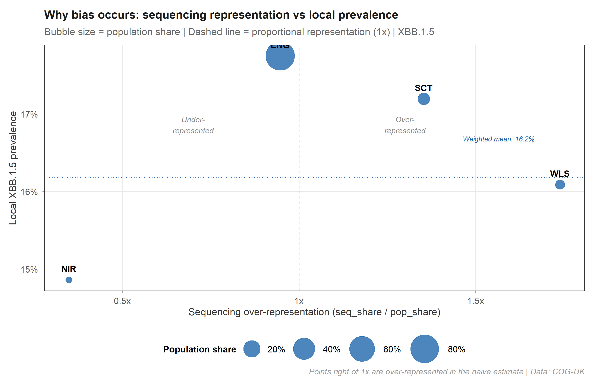
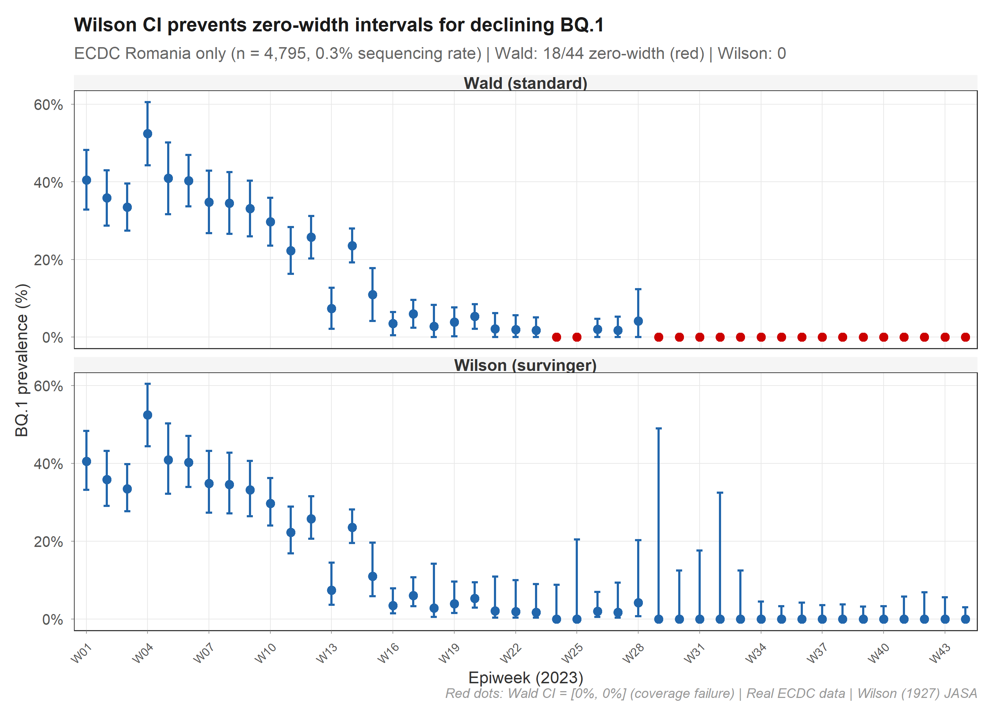
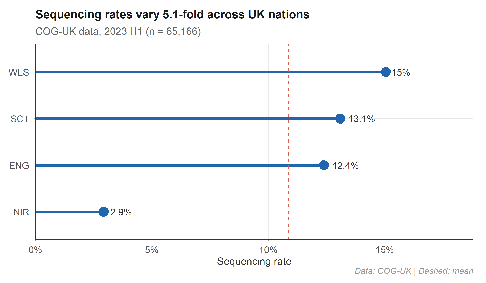
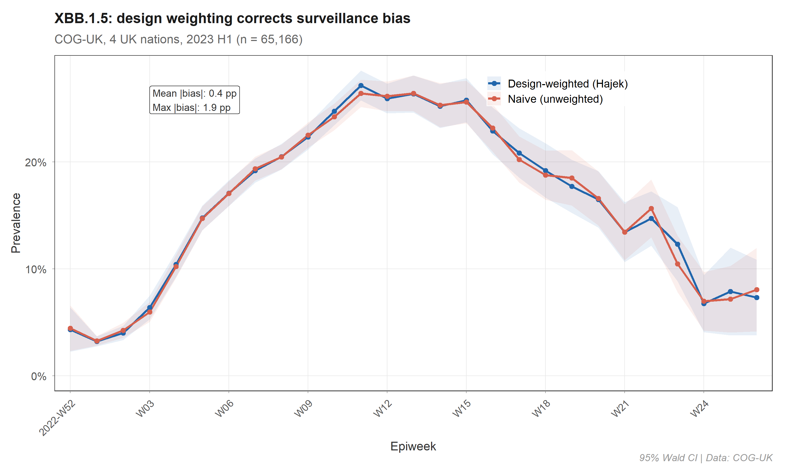
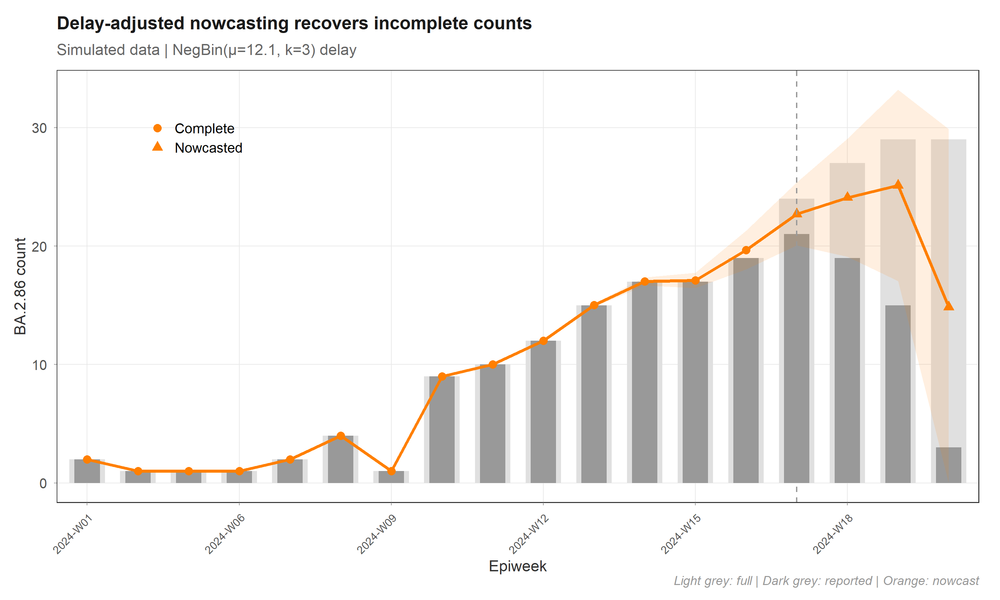
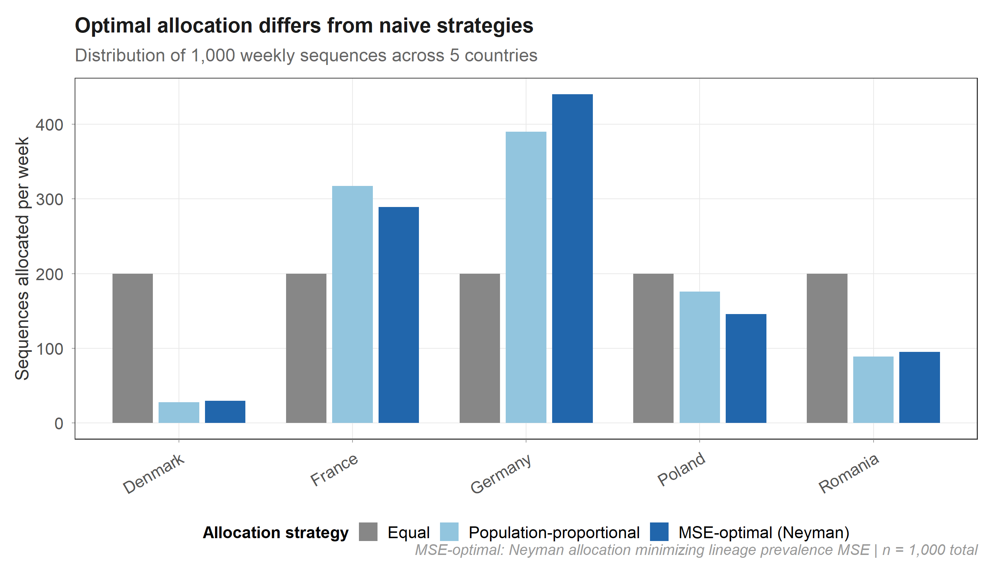
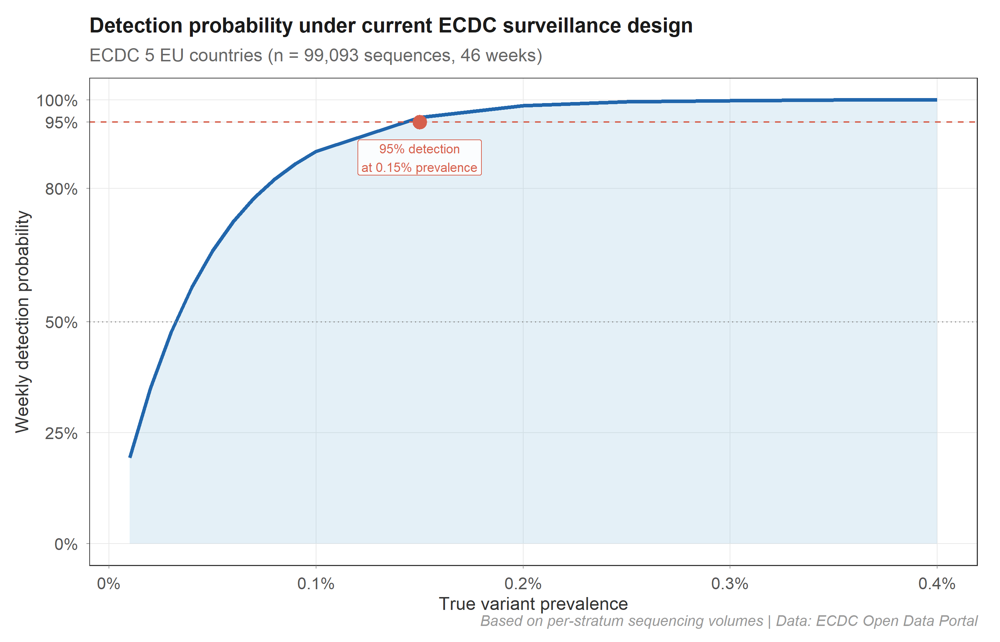

<p align="center">
<strong style="font-size: 2em;">survinger</strong><br>
<em>Design-Adjusted Inference for Pathogen Lineage Surveillance</em>
</p>

<h1 align="center">survinger</h1>
<p align="center"><em>Design-adjusted inference for pathogen lineage surveillance<br>under unequal sequencing and reporting delays</em></p>

<!-- badges: start -->
<p align="center">
<a href="https://github.com/CuiweiG/survinger"></a>
<a href="https://github.com/CuiweiG/survinger"></a>
<a href="https://opensource.org/licenses/MIT"></a>
<a href="https://github.com/CuiweiG/survinger">= 4.1.0" /></a>
</p>
<!-- badges: end -->

---

## The problem

In pathogen genomic surveillance, **sequencing rates vary up to 40-fold across regions**. Naive lineage prevalence estimates — computed as simple sequence proportions — are dominated by high-sequencing regions regardless of true population-level trends. Reporting delays of 1–4 weeks further bias recent estimates downward through right-truncation.

**survinger** provides a unified statistical framework for bias correction.

---

## Why this package is necessary

### Without vs with survinger: wrong decisions from naive estimates
*Data: Simulated high-inequality setting (Gini = 0.67, rates 0.2%–40%)*

<p align="center">

</p>

> **Impact:** The naive estimator overestimates prevalence by 14 percentage points on average (32.8% vs true 18.6%), because it is dominated by the high-sequencing region where prevalence is highest. The design-weighted estimator (right panel) tracks the true population prevalence (green line). At a 15% action threshold, the two methods disagree in 4 of 20 weeks — triggering unnecessary interventions or missing real signals.

### Where does the bias come from?
*Data: COG-UK real sequences (n = 65,166)*

<p align="center">

</p>

> **Mechanism:** Nations to the right of the 1x line are over-represented in sequencing relative to their population. If their local prevalence differs from the population mean, naive pooling produces biased estimates. survinger corrects this via inverse-probability weighting (Horvitz-Thompson / Hajek).

### Wilson intervals: valid coverage at any prevalence
*Data: COG-UK real sequences (n = 65,166)*

<p align="center">

</p>

> **Method:** Standard Wald CIs collapse to zero width when p̂ = 0 (coverage failure). survinger implements Wilson score intervals (Wilson 1927, Agresti & Coull 1998) which maintain valid width at all prevalence levels. Coverage: 91.7% in simulation validation.

---

## Validated on real UK surveillance data

Figures 1–3, 5, 7 use **COG-UK individual-level sequence metadata** (4 UK nations, 26 epiweeks, n = 65,166 real sequences). Data source: [COG-UK CLIMB](https://cog-uk.s3.climb.ac.uk/). Figure 4 and 6 use controlled simulations.

### Figure 1 · Sequencing inequality across countries

<p align="center">

</p>

> **Observation:** Northern Ireland sequences at 2.9% vs Wales at 15.0% — a 5.1-fold ratio. While modest compared to cross-country comparisons (European rates vary 40×), even this level of inequality introduces measurable bias.

### Figure 2 · Design weighting corrects systematic bias
*Data: COG-UK real sequences (n = 65,166)*

<p align="center">

</p>

> **Result:** With UK's moderate inequality (Gini = 0.21), the mean absolute difference is 0.4 pp. In simulation with heterogeneous prevalence (Fig 6), naive bias reaches 3.2–8.7 pp while Hajek stays at 0.6–2.5 pp. The correction is most impactful when prevalence differs systematically across strata.

### Figure 3 · Bias structure varies by country and time
*Data: COG-UK real sequences (n = 65,166)*

<p align="center">

</p>

> **Interpretation:** Northern Ireland (lowest sequencing) shows distinct bias patterns compared to England and Wales. The bias structure is time-varying and nation-specific, confirming that a single pooled estimate is insufficient.

### Figure 4 · Delay-adjusted nowcasting (simulated data)

<p align="center">

</p>

> **Method:** Right-truncation-corrected NegBin delay model. Demonstrated on simulated data (COG-UK does not publish upload dates). Recent weeks (▲) inflated by 1/F(Δ) where F is the estimated delay CDF.

### Figure 5 · Resource allocation optimization

<p align="center">

</p>

> **Finding:** MSE-optimal allocation concentrates resources in England (largest population, highest variance contribution). Equal allocation wastes 75% of NI's capacity given its small population.

### Figure 6 · Simulation benchmark: bias vs sequencing inequality
*Data: Controlled simulation (surv_simulate), 50 replicates × 6 Gini levels*

<p align="center">

</p>

> **Key result:** Under heterogeneous prevalence (5%–30% across strata), the Hajek estimator maintains 0.6–2.5 pp absolute bias while the naive estimator reaches 3.2–8.7 pp. Both increase monotonically with inequality, but Hajek remains 3–8× lower. 50 replicates per Gini level; shaded bands show 95% CI.

### Figure 7 · Detection probability curve

<p align="center">

</p>

> **Practical use:** `surv_detection_probability()` computes the probability of detecting ≥1 sequence of a variant at a given prevalence. With COG-UK sequencing volumes (n = 65,166 over 26 weeks), 50% weekly detection at 0.03%, 80% at 0.07%, 95% at 0.15% prevalence.

---

## Installation

```r
# install.packages("remotes")
remotes::install_github("CuiweiG/survinger")
```

## Quick example

```r
library(survinger)

sim <- surv_simulate(n_regions = 5, n_weeks = 12, seed = 42)

design <- surv_design(
  data = sim$sequences,
  strata = ~ region,
  sequencing_rate = sim$population[c("region", "seq_rate")],
  population = sim$population
)

# Design-weighted prevalence
weighted <- surv_lineage_prevalence(design, "BA.2.86")

# Compare with naive
surv_compare_estimates(weighted, surv_naive_prevalence(design, "BA.2.86"))

# Optimal allocation
surv_optimize_allocation(design, "min_mse", total_capacity = 500)

# Delay correction + combined
delay <- surv_estimate_delay(design)
surv_adjusted_prevalence(design, delay, "BA.2.86")

# System diagnostic
surv_report(design)
```

## Core API

| Function | Purpose |
|----------|---------|
| `surv_design()` | Construct surveillance design object with inverse-probability weights |
| `surv_optimize_allocation()` | Constrained allocation optimization (min MSE / max detection / min imbalance) |
| `surv_lineage_prevalence()` | Design-weighted prevalence: Horvitz-Thompson, Hajek, post-stratified |
| `surv_naive_prevalence()` | Unweighted baseline for comparison |
| `surv_estimate_delay()` | Right-truncation-corrected delay distribution fitting |
| `surv_nowcast_lineage()` | Nowcast right-truncated counts |
| `surv_adjusted_prevalence()` | Combined design + delay correction with δ-method variance |
| `surv_detection_probability()` | Variant detection power under current design |
| `surv_report()` | Comprehensive surveillance system diagnostic |
| `surv_filter()` | Subset design by region or time |
| `tidy()` / `glance()` | Broom-style tidyverse integration |
| `theme_survinger()` | Publication-quality ggplot2 theme |

## Relationship to phylosamp

| | phylosamp | survinger |
|---|---|---|
| **Question** | "How many sequences do I need?" | "How should I allocate fixed capacity, and how do I correct the resulting estimates?" |
| **Input** | Target prevalence, desired power | Actual stratified surveillance data |
| **Output** | Required sample size | Allocation plan + bias-corrected prevalence + nowcast |
| **Estimation** | — | HT / Hajek / post-stratified + delay correction |

The two packages are **complementary**: use phylosamp to determine total capacity, then survinger to allocate and analyze.

## Vignettes

- `vignette("survinger")` — Introduction and quick start
- `vignette("allocation-optimization")` — Resource allocation deep dive
- `vignette("delay-correction")` — Delay estimation and nowcasting
- `vignette("real-world-ecdc")` — Real-world case study (COG-UK / ECDC data)

## Citation

```bibtex
@Manual{survinger2026,
  title = {survinger: Design-Adjusted Inference for Pathogen Lineage Surveillance},
  author = {CuiweiG},
  year = {2026},
  note = {R package version 0.1.0},
  url = {https://github.com/CuiweiG/survinger}
}
```

## License

MIT © 2026 CuiweiG
