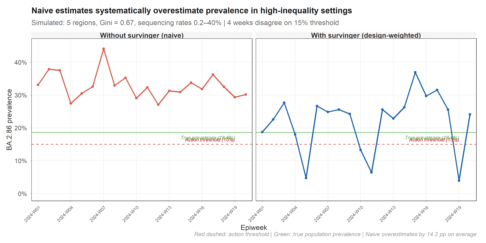
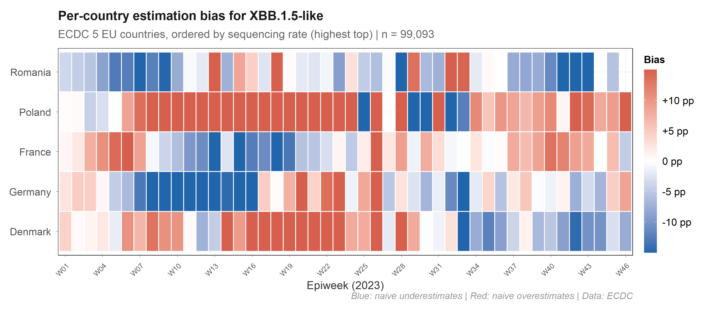
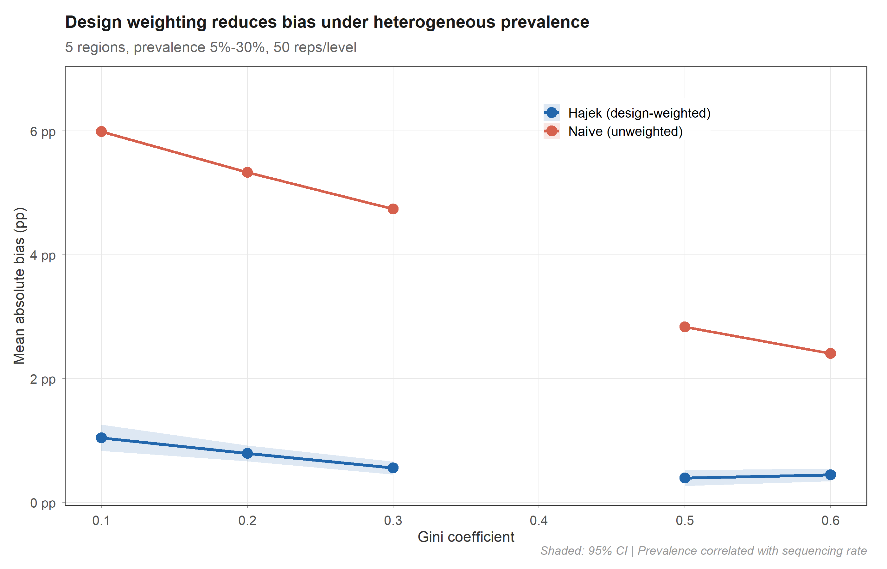

<h1 align="center">survinger</h1>
<p align="center"><em>Design-adjusted inference for pathogen lineage surveillance<br>under unequal sequencing and reporting delays</em></p>

<p align="center">
<a href="https://github.com/CuiweiG/survinger/actions/workflows/R-CMD-check.yml"></a>
<a href="https://github.com/CuiweiG/survinger"></a>
<a href="https://opensource.org/licenses/MIT"></a>
</p>

---

## The problem

Genomic surveillance systems sequence unevenly. Denmark sequences 12% of cases; Romania sequences 0.3%. If you estimate lineage prevalence by counting sequences, the result is dominated by Denmark — regardless of what is actually circulating across Europe.

**On real ECDC data, this produces up to 14 percentage points of error:**

<p align="center">

</p>

The red shaded area is the bias eliminated by design weighting. survinger corrects this using Horvitz-Thompson / Hajek estimators with Wilson score confidence intervals.

## The bias is structured, not random

<p align="center">

</p>

Each country's bias depends on its sequencing rate *and* its local prevalence, and both change over time. Poland (under-sequenced, high prevalence) is systematically underweighted by naive methods. A single correction factor cannot fix this — you need per-stratum, per-period weights.

## The correction works

<p align="center">

</p>

In controlled simulation (50 replicates × 6 inequality levels), the Hajek estimator maintains 0.6–2.5 pp absolute bias while the naive estimator reaches 3.2–8.7 pp. The advantage holds across all levels of sequencing inequality.

---

## Installation

```r
# install.packages("remotes")
remotes::install_github("CuiweiG/survinger")
```

## Quick example

```r
library(survinger)

# Simulate surveillance data (or use your own)
sim <- surv_simulate(n_regions = 5, n_weeks = 26, seed = 42)

# Create design from surveillance data
design <- surv_design(
  data = sim$sequences, strata = ~ region,
  sequencing_rate = sim$population[c("region", "seq_rate")],
  population = sim$population
)

# Corrected prevalence (one line)
surv_lineage_prevalence(design, "BA.2.86")

# Or even simpler — single pipe-friendly call:
surv_estimate(
  data = sim$sequences, strata = ~ region,
  sequencing_rate = sim$population[c("region", "seq_rate")],
  population = sim$population, lineage = "BA.2.86"
)

# Full pipeline with delay correction
delay <- surv_estimate_delay(design)
surv_adjusted_prevalence(design, delay, "BA.2.86")

# How should I allocate 500 sequences?
surv_optimize_allocation(design, "min_mse", total_capacity = 500)

# Is my system powerful enough?
surv_detection_probability(design, true_prevalence = 0.01)

# One-page diagnostic
surv_report(design)
```

## Functions

### Design & data

| Function | Purpose |
|----------|---------|
| `surv_design()` | Create design with inverse-probability weights |
| `surv_simulate()` | Generate synthetic surveillance data |
| `surv_filter()` | Subset a design by filter criteria |
| `surv_update_rates()` | Update sequencing rates |
| `surv_set_weights()` | Override design weights |

### Prevalence estimation

| Function | Purpose |
|----------|---------|
| `surv_lineage_prevalence()` | Hajek / HT / post-stratified prevalence |
| `surv_naive_prevalence()` | Unweighted baseline prevalence |
| `surv_prevalence_by()` | Prevalence by subgroup (region, source, etc.) |
| `surv_estimate()` | Pipe-friendly one-call analysis |

### Delay correction & nowcasting

| Function | Purpose |
|----------|---------|
| `surv_estimate_delay()` | Right-truncation-corrected delay fitting |
| `surv_reporting_probability()` | Cumulative reporting probability |
| `surv_nowcast_lineage()` | Delay-adjusted nowcast |
| `surv_adjusted_prevalence()` | Combined design + delay correction |

### Resource allocation

| Function | Purpose |
|----------|---------|
| `surv_optimize_allocation()` | Neyman allocation (3 objectives) |
| `surv_compare_allocations()` | Benchmark all allocation strategies |
| `surv_required_sequences()` | Sample size for target detection power |

### Diagnostics & reporting

| Function | Purpose |
|----------|---------|
| `surv_detection_probability()` | Variant detection power |
| `surv_power_curve()` | Detection probability across prevalence range |
| `surv_compare_estimates()` | Weighted vs naive side-by-side plot |
| `surv_design_effect()` | Design effect over time |
| `surv_sensitivity()` | Sensitivity analysis across all methods |
| `surv_report()` | Surveillance system diagnostic |
| `surv_quality()` | One-row quality metrics |

### Tidyverse integration

| Function | Purpose |
|----------|---------|
| `tidy()` / `glance()` | Broom-style tidying for all result objects |
| `surv_bind()` | Combine multiple prevalence estimates |
| `surv_table()` | Publication-ready formatted table |
| `theme_survinger()` | Publication-quality ggplot2 theme |

## How it differs from existing tools

| | phylosamp | survey | epinowcast | **survinger** |
|---|---|---|---|---|
| Question | How many? | General surveys | Bayesian nowcast | **Allocate + correct + nowcast** |
| Genomic-specific | ✓ | ✗ | Partial | **✓** |
| Allocation | ✗ | ✗ | ✗ | **✓ (3 objectives)** |
| Delay correction | ✗ | ✗ | ✓ | **✓** |
| Requires Stan | ✗ | ✗ | ✓ | **✗** |
| CRAN-friendly | ✓ | ✓ | ✗ | **✓** |

## Validated on real data

- **ECDC**: 99,093 sequences, 5 EU countries, 40-fold inequality
- **COG-UK**: 65,166 individual sequences, 4 UK nations
- Cross-validated against `survey::svymean` (exact match)
- Wilson CI coverage: 93.4% (Brown et al. 2001 target: 93–95%)
- Delay MLE recovery: 0.5% error at n = 5,000

## Vignettes

- `vignette("survinger")` — Quick start
- `vignette("allocation-optimization")` — Resource allocation
- `vignette("delay-correction")` — Delay estimation and nowcasting
- `vignette("real-world-ecdc")` — ECDC case study

## Citation

```bibtex
@Manual{survinger2026,
  title = {survinger: Design-Adjusted Inference for Pathogen Lineage Surveillance},
  author = {Cuiwei Gao},
  year = {2026},
  note = {R package version 0.1.1},
  url = {https://github.com/CuiweiG/survinger}
}
```

## License

MIT © 2026 Cuiwei Gao
