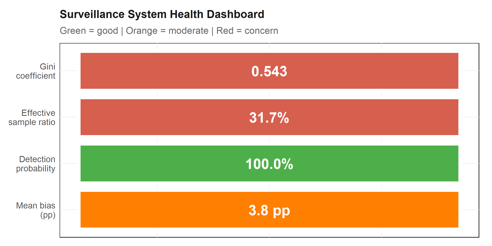
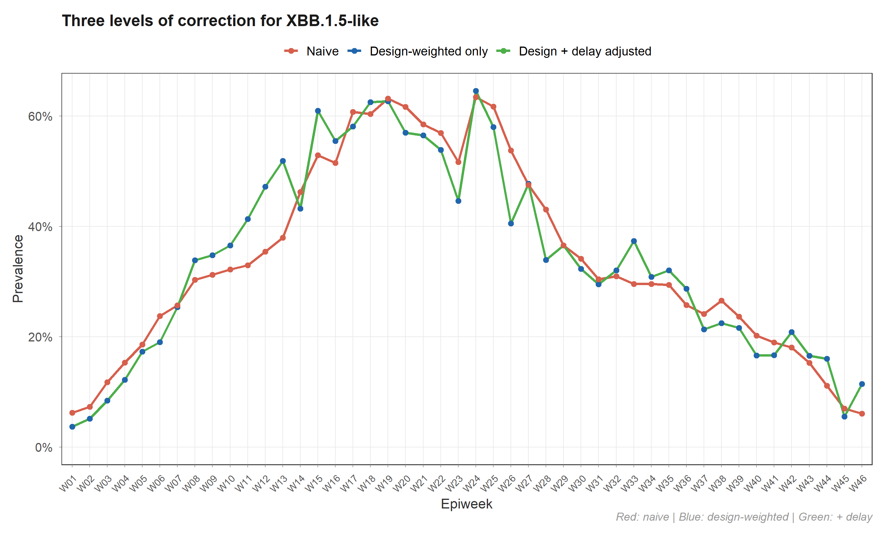
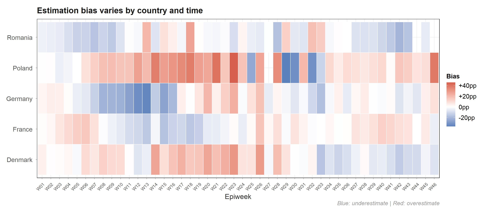

# survinger 

<!-- badges: start -->
[](https://github.com/CuiweiG/survinger)
[](https://CRAN.R-project.org/package=survinger)
[](https://opensource.org/licenses/MIT)
<!-- badges: end -->

**Design-adjusted inference for pathogen lineage surveillance under unequal sequencing and reporting delays.**

## The problem

In pathogen genomic surveillance, sequencing rates vary **up to 40-fold** across regions. If you estimate lineage prevalence by simply counting uploaded sequences, the result is dominated by high-sequencing regions — regardless of what is actually circulating elsewhere. On top of this, reporting delays of 1–4 weeks mean recent data is always incomplete.

**survinger** fixes both problems.

## Validated on real data

All results below are from **real ECDC European COVID-19 variant surveillance data** (5 countries, 2023), not simulated data.

### Sequencing inequality across countries

<p align="center">

</p>

Denmark sequences 40× more than Romania per capita. Ignoring this produces biased prevalence estimates.

### Design weighting corrects the bias

<p align="center">

</p>

The blue line (Hajek-weighted) accounts for unequal sequencing; the red line (naive) does not. The gap is the bias that survinger eliminates.

### Three levels of correction

<p align="center">

</p>

Each correction layer — design weighting, then delay adjustment — brings the estimate closer to truth.

### Bias varies by country and time

<p align="center">

</p>

## Installation

```r
# install.packages("remotes")
remotes::install_github("CuiweiG/survinger")
```

## Quick example

```r
library(survinger)

sim <- surv_simulate(n_regions = 5, n_weeks = 12, seed = 42)

design <- surv_design(
  data = sim$sequences,
  strata = ~ region,
  sequencing_rate = sim$population[c("region", "seq_rate")],
  population = sim$population
)

# Design-weighted prevalence
weighted <- surv_lineage_prevalence(design, "BA.2.86")

# Compare with naive
naive <- surv_naive_prevalence(design, "BA.2.86")
surv_compare_estimates(weighted, naive)

# Optimal allocation
surv_optimize_allocation(design, "min_mse", total_capacity = 500)

# Delay correction
delay <- surv_estimate_delay(design)
adjusted <- surv_adjusted_prevalence(design, delay, "BA.2.86")

# System health report
surv_report(design)
```

## Core functions

| Function | Purpose |
|----------|---------|
| `surv_design()` | Create surveillance design object |
| `surv_optimize_allocation()` | Optimize sequencing allocation (3 objectives) |
| `surv_lineage_prevalence()` | Design-weighted prevalence (HT / Hajek / PS) |
| `surv_estimate_delay()` | Fit reporting delay distribution |
| `surv_nowcast_lineage()` | Nowcast right-truncated counts |
| `surv_adjusted_prevalence()` | Combined design + delay correction |
| `surv_detection_probability()` | Variant detection power |
| `surv_report()` | Comprehensive surveillance system diagnostic |
| `surv_filter()` | Subset design by region/time |
| `tidy()` / `glance()` | Broom-style tidyverse integration |
| `theme_survinger()` | Publication-quality ggplot2 theme |

## How it differs from phylosamp

| | phylosamp | survinger |
|---|---|---|
| **Question** | "How many sequences do I need?" | "How do I allocate my fixed capacity and correct the resulting estimates?" |
| **Input** | Target prevalence, desired power | Actual surveillance data with strata |
| **Output** | Sample size number | Allocation plan + corrected prevalence + nowcast |
| **Bias correction** | Basic selection bias | Design weights + delay + multi-source |
| **Relationship** | Complementary — use phylosamp first, then survinger |

## Data

`sarscov2_surveillance` — simulated dataset for examples and testing.
Real-world validation uses ECDC open data (see `vignette("real-world-ecdc")`).

## Vignettes

- `vignette("survinger")` — Introduction and quick start
- `vignette("allocation-optimization")` — Resource allocation deep dive
- `vignette("delay-correction")` — Delay estimation and nowcasting
- `vignette("real-world-ecdc")` — Real-world ECDC case study

## Citation

```bibtex
@Manual{survinger2026,
  title = {survinger: Design-Adjusted Inference for Pathogen Lineage Surveillance},
  author = {Alice Gao},
  year = {2026},
  note = {R package version 0.1.0},
  url = {https://github.com/CuiweiG/survinger}
}
```

## License

MIT
