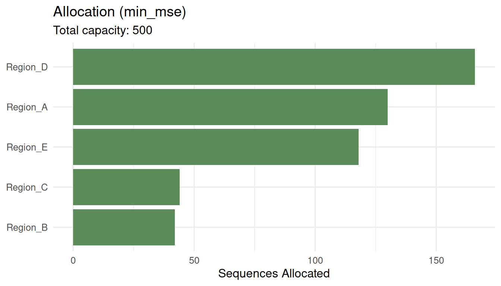

# Optimizing Sequencing Resource Allocation

## Why allocation matters

In genomic surveillance, the total number of sequences you can generate
each week is fixed by lab capacity and budget. The question is not *how
many* to sequence (phylosamp answers that), but *how to distribute* a
fixed number across regions, institutions, and sample sources.

Poor allocation wastes resources. If you sequence proportionally to
submissions (which is what most systems do by default), you
over-represent regions that send more samples — which are often the same
regions that already have the highest sequencing rates.

## The three objectives

survinger supports three optimization objectives:

- **`min_mse`**: Minimize the mean squared error of lineage prevalence
  estimates. This is a Neyman-type allocation that gives more sequences
  to high-variance strata.

- **`max_detection`**: Maximize the probability of detecting a rare
  variant. This spreads sequences to maximize geographic coverage.

- **`min_imbalance`**: Minimize the deviation from
  population-proportional representation. This ensures each region is
  fairly represented.

## Example

``` r
library(survinger)
data(sarscov2_surveillance)

design <- surv_design(
  data = sarscov2_surveillance$sequences,
  strata = ~ region,
  sequencing_rate = sarscov2_surveillance$population[c("region", "seq_rate")],
  population = sarscov2_surveillance$population,
  source_type = "source_type"
)
```

### Optimize for minimum MSE

``` r
alloc_mse <- surv_optimize_allocation(design, "min_mse", total_capacity = 500)
print(alloc_mse)
#> ── Optimal Sequencing Allocation ───────────────────────────────────────────────
#> Objective: min_mse
#> Total capacity: 500 sequences
#> Strata: 5
#> 
#> # A tibble: 5 × 3
#>   region   n_allocated proportion
#>   <chr>          <int>      <dbl>
#> 1 Region_A         130      0.26 
#> 2 Region_B          42      0.084
#> 3 Region_C          44      0.088
#> 4 Region_D         166      0.332
#> 5 Region_E         118      0.236
plot(alloc_mse)
```



### Compare all strategies

``` r
comparison <- surv_compare_allocations(design, total_capacity = 500)
print(comparison)
#> # A tibble: 5 × 4
#>   strategy      total_mse detection_prob  imbalance
#>   <chr>             <dbl>          <dbl>      <dbl>
#> 1 equal          0.000569          0.993 0.0486    
#> 2 proportional   0.000460          0.993 0.00000482
#> 3 min_mse        0.000459          0.993 0.0000292 
#> 4 max_detection  0.000560          0.993 0.0456    
#> 5 min_imbalance  0.000460          0.993 0.00000482
```

The table shows the trade-off: minimizing MSE may increase imbalance,
while proportional allocation sacrifices detection power.

### With minimum coverage constraints

``` r
alloc_floor <- surv_optimize_allocation(
  design, "min_mse", total_capacity = 500, min_per_stratum = 20
)
print(alloc_floor)
#> ── Optimal Sequencing Allocation ───────────────────────────────────────────────
#> Objective: min_mse
#> Total capacity: 500 sequences
#> Strata: 5
#> 
#> # A tibble: 5 × 3
#>   region   n_allocated proportion
#>   <chr>          <int>      <dbl>
#> 1 Region_A         130      0.26 
#> 2 Region_B          42      0.084
#> 3 Region_C          44      0.088
#> 4 Region_D         166      0.332
#> 5 Region_E         118      0.236
```

Setting `min_per_stratum = 20` ensures every region gets at least 20
sequences, preventing any region from being invisible.

## Choosing an objective

- Use **`min_mse`** when your primary goal is accurate prevalence
  tracking.
- Use **`max_detection`** when hunting for rare emerging variants.
- Use **`min_imbalance`** when equity and representativeness are
  priorities.

In practice, reviewing the
[`surv_compare_allocations()`](https://cuiweig.github.io/survinger/reference/surv_compare_allocations.md)
output helps stakeholders understand the trade-offs and choose based on
their mandate.
