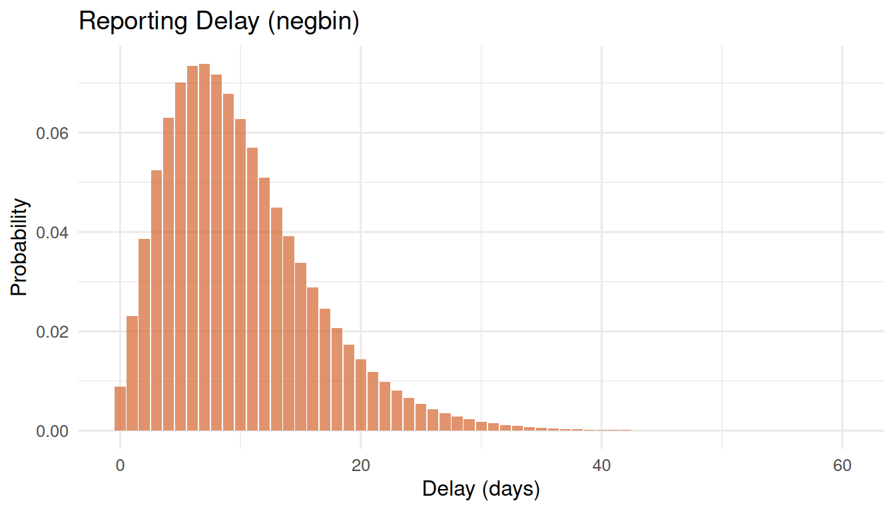

# Delay-Adjusted Nowcasting

## The right-truncation problem

From sample collection to sequence upload, there is a delay of typically
1–4 weeks. This means that when you look at the latest data, the most
recent weeks are always incomplete — not because fewer people were
infected, but because results have not arrived yet.

If you ignore this and plot raw counts, you see a false decline in the
most recent weeks. This is called **right-truncation bias**.

## Estimating the delay distribution

survinger fits a parametric delay distribution accounting for the fact
that we can only observe delays shorter than the time elapsed since
collection (right-truncation correction).

``` r
library(survinger)
data(sarscov2_surveillance)

design <- surv_design(
  data = sarscov2_surveillance$sequences,
  strata = ~ region,
  sequencing_rate = sarscov2_surveillance$population[c("region", "seq_rate")],
  population = sarscov2_surveillance$population
)

delay_fit <- surv_estimate_delay(design, distribution = "negbin")
print(delay_fit)
#> ── Reporting Delay Distribution ────────────────────────────────────────────────
#> Distribution: "negbin"
#> Strata: none (pooled)
#> Observations: 1349
#> Mean delay: 9.9 days
#> 
#> # A tibble: 1 × 5
#>   stratum distribution    mu  size converged
#>   <chr>   <chr>        <dbl> <dbl> <lgl>    
#> 1 all     negbin        9.95  3.52 TRUE
plot(delay_fit)
```



## Reporting probability

Given the fitted delay, we can ask: what fraction of sequences collected
*d* days ago have been reported by now?

``` r
days <- c(7, 14, 21, 28)
probs <- surv_reporting_probability(delay_fit, delta = days)
data.frame(days_ago = days, prob_reported = round(probs, 3))
#>   days_ago prob_reported
#> 1        7         0.403
#> 2       14         0.797
#> 3       21         0.949
#> 4       28         0.989
```

Sequences collected 7 days ago may only be partially reported, while
those from 28 days ago are nearly complete.

## Nowcasting

Nowcasting inflates observed counts by dividing by the reporting
probability, giving a better estimate of the true number:

``` r
nowcast <- surv_nowcast_lineage(design, delay_fit, "BA.2.86")
plot(nowcast)
```


Observed (grey bars) vs nowcasted (orange line) counts for BA.2.86

The grey bars show what has been observed; the orange line shows the
delay-corrected estimate. The gap is largest in the most recent weeks.

## Combined design + delay correction

The main inference function applies both corrections simultaneously:

``` r
adjusted <- surv_adjusted_prevalence(design, delay_fit, "BA.2.86")
print(adjusted)
#> ── Design-Weighted Delay-Adjusted Prevalence ───────────────────────────────────
#> Correction: "design:hajek+delay:direct"
#> 
#> # A tibble: 26 × 9
#>    time     lineage n_obs_raw n_obs_adjusted prevalence     se ci_lower ci_upper
#>    <chr>    <chr>       <int>          <dbl>      <dbl>  <dbl>    <dbl>    <dbl>
#>  1 2024-W01 BA.2.86        53             53    0       0             0   0     
#>  2 2024-W02 BA.2.86        68             68    0.00597 0.0178        0   0.0408
#>  3 2024-W03 BA.2.86        40             40    0.143   0.126         0   0.389 
#>  4 2024-W04 BA.2.86        41             41    0       0             0   0     
#>  5 2024-W05 BA.2.86        48             48    0       0             0   0     
#>  6 2024-W06 BA.2.86        52             52    0       0             0   0     
#>  7 2024-W07 BA.2.86        62             62    0.00740 0.0204        0   0.0473
#>  8 2024-W08 BA.2.86        55             55    0.0195  0.0332        0   0.0847
#>  9 2024-W09 BA.2.86        43             43    0.0261  0.0480        0   0.120 
#> 10 2024-W10 BA.2.86        46             46    0.0697  0.0621        0   0.191 
#> # ℹ 16 more rows
#> # ℹ 1 more variable: mean_report_prob <dbl>
```

The `mean_report_prob` column shows how complete each week’s data is.
Low values indicate that the delay correction is doing heavy lifting.

## Choosing a delay distribution

- **`negbin`** (default): Handles overdispersion well. Recommended for
  most settings.
- **`poisson`**: Use when delays are very regular (rare).
- **`lognormal`**: Use when delays have a heavy right tail.
- **`nonparametric`**: No distributional assumption. Use when you have
  enough data and suspect the parametric forms do not fit.
