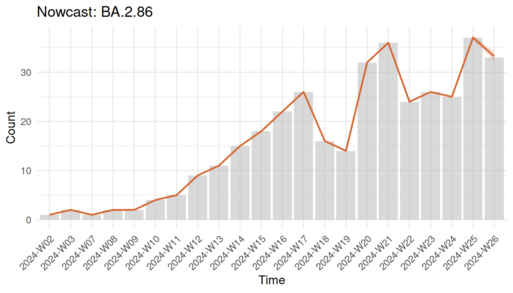

# Introduction to survinger

## The problem

Pathogen genomic surveillance is the backbone of pandemic preparedness.
By sequencing positive samples and tracking lineage frequencies over
time, public health agencies can detect emerging variants early and
monitor their spread.

However, real-world surveillance systems have a fundamental bias
problem: **sequencing rates are highly unequal across regions and
institutions.** A well-resourced capital city might sequence 15% of
positive cases, while a rural area sequences only 0.5%. If you simply
count uploaded sequences to estimate “what fraction is variant X?”, the
answer is dominated by high-sequencing regions — regardless of what is
actually circulating elsewhere.

On top of this, there is a **reporting delay** problem. From sample
collection to sequence upload, 1–4 weeks can pass. This means the most
recent weeks of data are always incomplete, and naive trend estimates
systematically undercount the latest period.

**survinger** addresses both problems in a unified framework.

## What survinger does

The package provides three core capabilities:

1.  **Resource allocation**: Given limited sequencing capacity, how
    should sequences be distributed across regions and sources to
    maximize surveillance value?

2.  **Design-weighted estimation**: Given that sequencing rates differ,
    how do we estimate lineage prevalence correctly?

3.  **Delay-adjusted nowcasting**: Given that recent data is incomplete,
    what is the true current trend?

## Quick start

``` r
library(survinger)

# Load example data (simulated, 5 regions, 26 weeks)
data(sarscov2_surveillance)
sim <- sarscov2_surveillance

# Create a surveillance design object
design <- surv_design(
  data = sim$sequences,
  strata = ~ region,
  sequencing_rate = sim$population[c("region", "seq_rate")],
  population = sim$population,
  source_type = "source_type"
)
print(design)
#> ── Genomic Surveillance Design ─────────────────────────────────────────────────
#> Observations: 1,349
#> Strata: 5 (region)
#> Date range: 2024-01-01 to 2024-06-30
#> Lineages: 4
#> Sources: clinical, sentinel, wastewater
#> Weight range: [6.901, 225.741]
```

The design object captures the stratification structure and computes
inverse-probability weights automatically.

## Comparing weighted vs naive estimates

The core value proposition: **design-weighted estimates correct for
sequencing inequality.**

``` r
weighted <- surv_lineage_prevalence(design, "BA.2.86", method = "hajek")
naive <- surv_naive_prevalence(design, "BA.2.86")
surv_compare_estimates(weighted, naive)
```


Weighted vs naive prevalence estimates for BA.2.86

The gap between the two lines shows the bias introduced by ignoring
unequal sequencing rates.

## Optimizing resource allocation

If you have 500 sequencing slots this week, how should you distribute
them?

``` r
alloc <- surv_optimize_allocation(design, "min_mse", total_capacity = 500)
print(alloc)
#> ── Optimal Sequencing Allocation ───────────────────────────────────────────────
#> Objective: min_mse
#> Total capacity: 500 sequences
#> Strata: 5
#> 
#> # A tibble: 5 × 3
#>   region   n_allocated proportion
#>   <chr>          <int>      <dbl>
#> 1 Region_A         130      0.26 
#> 2 Region_B          42      0.084
#> 3 Region_C          44      0.088
#> 4 Region_D         166      0.332
#> 5 Region_E         118      0.236
```

Compare with alternative strategies:

``` r
surv_compare_allocations(design, total_capacity = 500)
#> # A tibble: 5 × 4
#>   strategy      total_mse detection_prob  imbalance
#>   <chr>             <dbl>          <dbl>      <dbl>
#> 1 equal          0.000569          0.993 0.0486    
#> 2 proportional   0.000460          0.993 0.00000482
#> 3 min_mse        0.000459          0.993 0.0000292 
#> 4 max_detection  0.000560          0.993 0.0456    
#> 5 min_imbalance  0.000460          0.993 0.00000482
```

## Delay correction

Estimate the reporting delay distribution and nowcast recent counts:

``` r
delay_fit <- surv_estimate_delay(design)
print(delay_fit)
#> ── Reporting Delay Distribution ────────────────────────────────────────────────
#> Distribution: "negbin"
#> Strata: none (pooled)
#> Observations: 1349
#> Mean delay: 9.9 days
#> 
#> # A tibble: 1 × 5
#>   stratum distribution    mu  size converged
#>   <chr>   <chr>        <dbl> <dbl> <lgl>    
#> 1 all     negbin        9.95  3.52 TRUE

nowcast <- surv_nowcast_lineage(design, delay_fit, "BA.2.86")
plot(nowcast)
```



## Combined correction

The main inference function applies both design weighting and delay
correction simultaneously:

``` r
adjusted <- surv_adjusted_prevalence(design, delay_fit, "BA.2.86")
print(adjusted)
#> ── Design-Weighted Delay-Adjusted Prevalence ───────────────────────────────────
#> Correction: "design:hajek+delay:direct"
#> 
#> # A tibble: 26 × 9
#>    time     lineage n_obs_raw n_obs_adjusted prevalence     se ci_lower ci_upper
#>    <chr>    <chr>       <int>          <dbl>      <dbl>  <dbl>    <dbl>    <dbl>
#>  1 2024-W01 BA.2.86        53             53    0       0             0   0     
#>  2 2024-W02 BA.2.86        68             68    0.00597 0.0178        0   0.0408
#>  3 2024-W03 BA.2.86        40             40    0.143   0.126         0   0.389 
#>  4 2024-W04 BA.2.86        41             41    0       0             0   0     
#>  5 2024-W05 BA.2.86        48             48    0       0             0   0     
#>  6 2024-W06 BA.2.86        52             52    0       0             0   0     
#>  7 2024-W07 BA.2.86        62             62    0.00740 0.0204        0   0.0473
#>  8 2024-W08 BA.2.86        55             55    0.0195  0.0332        0   0.0847
#>  9 2024-W09 BA.2.86        43             43    0.0261  0.0480        0   0.120 
#> 10 2024-W10 BA.2.86        46             46    0.0697  0.0621        0   0.191 
#> # ℹ 16 more rows
#> # ℹ 1 more variable: mean_report_prob <dbl>
```

## Detection power

How likely is the current system to detect a variant at 1% prevalence?

``` r
det <- surv_detection_probability(design, true_prevalence = 0.01)
cat("Weekly detection probability:", round(det$overall, 3), "\n")
#> Weekly detection probability: 0.406
cat("Required sequences for 95% detection:", surv_required_sequences(0.01), "\n")
#> Required sequences for 95% detection: 299
```

## How survinger differs from phylosamp

The [phylosamp](https://CRAN.R-project.org/package=phylosamp) package
provides sample size calculations for variant surveillance — it answers
*“how many sequences do I need in total?”*

survinger answers the next question: *“Given my fixed capacity, how do I
allocate it optimally, and how do I correct the resulting estimates for
the biases my design introduces?”*

The two packages are complementary, not competing.

## Next steps

- [`vignette("allocation-optimization")`](https://cuiweig.github.io/survinger/articles/allocation-optimization.md)
  — deep dive into allocation
- [`vignette("delay-correction")`](https://cuiweig.github.io/survinger/articles/delay-correction.md)
  — delay estimation and nowcasting
