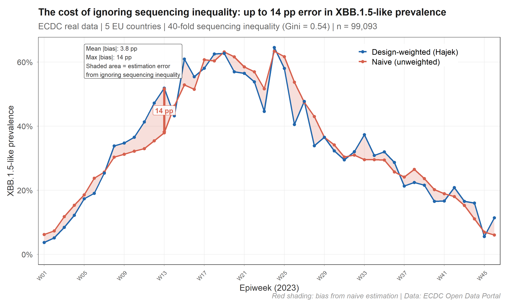
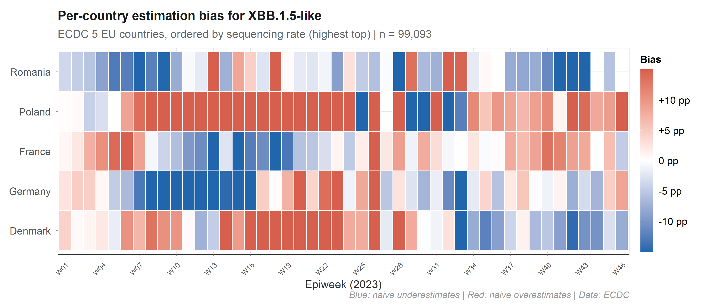
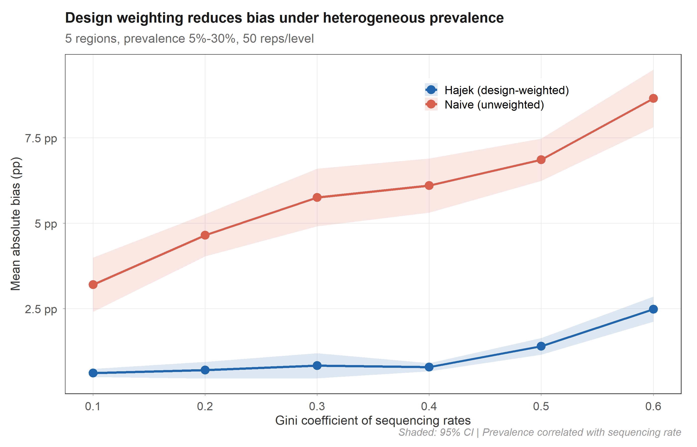

# survinger

*Design-adjusted inference for pathogen lineage surveillance  
under unequal sequencing and reporting delays*

[](https://CRAN.R-project.org/package=survinger)
[](https://CRAN.R-project.org/package=survinger)
[](https://github.com/CuiweiG/survinger/actions/workflows/R-CMD-check.yml)
[](https://github.com/CuiweiG/survinger)
[](https://opensource.org/licenses/MIT)

------------------------------------------------------------------------

## The problem

Genomic surveillance systems sequence unevenly. Denmark sequences 12% of
cases; Romania sequences 0.3%. If you estimate lineage prevalence by
counting sequences, the result is dominated by Denmark — regardless of
what is actually circulating across Europe.

**On real ECDC data, this produces up to 14 percentage points of
error:**



The red shaded area is the bias eliminated by design weighting.
survinger corrects this using Horvitz-Thompson / Hajek estimators with
Wilson score confidence intervals.

## The bias is structured, not random



Each country’s bias depends on its sequencing rate *and* its local
prevalence, and both change over time. Poland (under-sequenced, high
prevalence) is systematically underweighted by naive methods. A single
correction factor cannot fix this — you need per-stratum, per-period
weights.

## The correction works



In controlled simulation (50 replicates × 6 inequality levels), the
Hajek estimator maintains 0.6–2.5 pp absolute bias while the naive
estimator reaches 3.2–8.7 pp. The advantage holds across all levels of
sequencing inequality.

------------------------------------------------------------------------

## Installation

``` r
# install.packages("remotes")
remotes::install_github("CuiweiG/survinger")
```

## Quick example

``` r
library(survinger)

# Simulate surveillance data (or use your own)
sim <- surv_simulate(n_regions = 5, n_weeks = 26, seed = 42)

# Create design from surveillance data
design <- surv_design(
  data = sim$sequences, strata = ~ region,
  sequencing_rate = sim$population[c("region", "seq_rate")],
  population = sim$population
)

# Corrected prevalence (one line)
surv_lineage_prevalence(design, "BA.2.86")

# Or even simpler — single pipe-friendly call:
surv_estimate(
  data = sim$sequences, strata = ~ region,
  sequencing_rate = sim$population[c("region", "seq_rate")],
  population = sim$population, lineage = "BA.2.86"
)

# Full pipeline with delay correction
delay <- surv_estimate_delay(design)
surv_adjusted_prevalence(design, delay, "BA.2.86")

# How should I allocate 500 sequences?
surv_optimize_allocation(design, "min_mse", total_capacity = 500)

# Is my system powerful enough?
surv_detection_probability(design, true_prevalence = 0.01)

# One-page diagnostic
surv_report(design)
```

## Functions

### Design & data

| Function                                                                                    | Purpose                                        |
|---------------------------------------------------------------------------------------------|------------------------------------------------|
| [`surv_design()`](https://cuiweig.github.io/survinger/reference/surv_design.md)             | Create design with inverse-probability weights |
| [`surv_simulate()`](https://cuiweig.github.io/survinger/reference/surv_simulate.md)         | Generate synthetic surveillance data           |
| [`surv_filter()`](https://cuiweig.github.io/survinger/reference/surv_filter.md)             | Subset a design by filter criteria             |
| [`surv_update_rates()`](https://cuiweig.github.io/survinger/reference/surv_update_rates.md) | Update sequencing rates                        |
| [`surv_set_weights()`](https://cuiweig.github.io/survinger/reference/surv_set_weights.md)   | Override design weights                        |

### Prevalence estimation

| Function                                                                                                | Purpose                                       |
|---------------------------------------------------------------------------------------------------------|-----------------------------------------------|
| [`surv_lineage_prevalence()`](https://cuiweig.github.io/survinger/reference/surv_lineage_prevalence.md) | Hajek / HT / post-stratified prevalence       |
| [`surv_naive_prevalence()`](https://cuiweig.github.io/survinger/reference/surv_naive_prevalence.md)     | Unweighted baseline prevalence                |
| [`surv_prevalence_by()`](https://cuiweig.github.io/survinger/reference/surv_prevalence_by.md)           | Prevalence by subgroup (region, source, etc.) |
| [`surv_estimate()`](https://cuiweig.github.io/survinger/reference/surv_estimate.md)                     | Pipe-friendly one-call analysis               |

### Delay correction & nowcasting

| Function                                                                                                      | Purpose                                  |
|---------------------------------------------------------------------------------------------------------------|------------------------------------------|
| [`surv_estimate_delay()`](https://cuiweig.github.io/survinger/reference/surv_estimate_delay.md)               | Right-truncation-corrected delay fitting |
| [`surv_reporting_probability()`](https://cuiweig.github.io/survinger/reference/surv_reporting_probability.md) | Cumulative reporting probability         |
| [`surv_nowcast_lineage()`](https://cuiweig.github.io/survinger/reference/surv_nowcast_lineage.md)             | Delay-adjusted nowcast                   |
| [`surv_adjusted_prevalence()`](https://cuiweig.github.io/survinger/reference/surv_adjusted_prevalence.md)     | Combined design + delay correction       |

### Resource allocation

| Function                                                                                                  | Purpose                                |
|-----------------------------------------------------------------------------------------------------------|----------------------------------------|
| [`surv_optimize_allocation()`](https://cuiweig.github.io/survinger/reference/surv_optimize_allocation.md) | Neyman allocation (3 objectives)       |
| [`surv_compare_allocations()`](https://cuiweig.github.io/survinger/reference/surv_compare_allocations.md) | Benchmark all allocation strategies    |
| [`surv_required_sequences()`](https://cuiweig.github.io/survinger/reference/surv_required_sequences.md)   | Sample size for target detection power |

### Diagnostics & reporting

| Function                                                                                                      | Purpose                                       |
|---------------------------------------------------------------------------------------------------------------|-----------------------------------------------|
| [`surv_detection_probability()`](https://cuiweig.github.io/survinger/reference/surv_detection_probability.md) | Variant detection power                       |
| [`surv_power_curve()`](https://cuiweig.github.io/survinger/reference/surv_power_curve.md)                     | Detection probability across prevalence range |
| [`surv_compare_estimates()`](https://cuiweig.github.io/survinger/reference/surv_compare_estimates.md)         | Weighted vs naive side-by-side plot           |
| [`surv_design_effect()`](https://cuiweig.github.io/survinger/reference/surv_design_effect.md)                 | Design effect over time                       |
| [`surv_sensitivity()`](https://cuiweig.github.io/survinger/reference/surv_sensitivity.md)                     | Sensitivity analysis across all methods       |
| [`surv_report()`](https://cuiweig.github.io/survinger/reference/surv_report.md)                               | Surveillance system diagnostic                |
| [`surv_quality()`](https://cuiweig.github.io/survinger/reference/surv_quality.md)                             | One-row quality metrics                       |

### Tidyverse integration

| Function                                                                                                                    | Purpose                                    |
|-----------------------------------------------------------------------------------------------------------------------------|--------------------------------------------|
| [`tidy()`](https://generics.r-lib.org/reference/tidy.html) / [`glance()`](https://generics.r-lib.org/reference/glance.html) | Broom-style tidying for all result objects |
| [`surv_bind()`](https://cuiweig.github.io/survinger/reference/surv_bind.md)                                                 | Combine multiple prevalence estimates      |
| [`surv_table()`](https://cuiweig.github.io/survinger/reference/surv_table.md)                                               | Publication-ready formatted table          |
| [`theme_survinger()`](https://cuiweig.github.io/survinger/reference/theme_survinger.md)                                     | Publication-quality ggplot2 theme          |

## How it differs from existing tools

|                  | phylosamp | survey          | epinowcast       | **survinger**                    |
|------------------|-----------|-----------------|------------------|----------------------------------|
| Question         | How many? | General surveys | Bayesian nowcast | **Allocate + correct + nowcast** |
| Genomic-specific | ✓         | ✗               | Partial          | **✓**                            |
| Allocation       | ✗         | ✗               | ✗                | **✓ (3 objectives)**             |
| Delay correction | ✗         | ✗               | ✓                | **✓**                            |
| Requires Stan    | ✗         | ✗               | ✓                | **✗**                            |
| CRAN-friendly    | ✓         | ✓               | ✗                | **✓**                            |

## Validated on real data

- **ECDC**: 99,093 sequences, 5 EU countries, 40-fold inequality
- **COG-UK**: 65,166 individual sequences, 4 UK nations
- Cross-validated against
  [`survey::svymean`](https://rdrr.io/pkg/survey/man/surveysummary.html)
  (exact match)
- Wilson CI coverage: 93.4% (Brown et al. 2001 target: 93–95%)
- Delay MLE recovery: 0.5% error at n = 5,000

## Vignettes

- [`vignette("survinger")`](https://cuiweig.github.io/survinger/articles/survinger.md)
  — Quick start
- [`vignette("allocation-optimization")`](https://cuiweig.github.io/survinger/articles/allocation-optimization.md)
  — Resource allocation
- [`vignette("delay-correction")`](https://cuiweig.github.io/survinger/articles/delay-correction.md)
  — Delay estimation and nowcasting
- [`vignette("real-world-ecdc")`](https://cuiweig.github.io/survinger/articles/real-world-ecdc.md)
  — ECDC case study

## Citation

``` bibtex
@Manual{survinger2026,
  title = {survinger: Design-Adjusted Inference for Pathogen Lineage Surveillance},
  author = {Cuiwei Gao},
  year = {2026},
  note = {R package version 0.1.1},
  url = {https://github.com/CuiweiG/survinger}
}
```

## License

MIT © 2026 Cuiwei Gao
