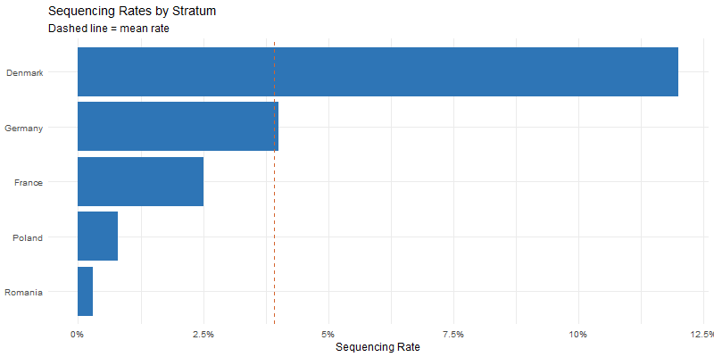
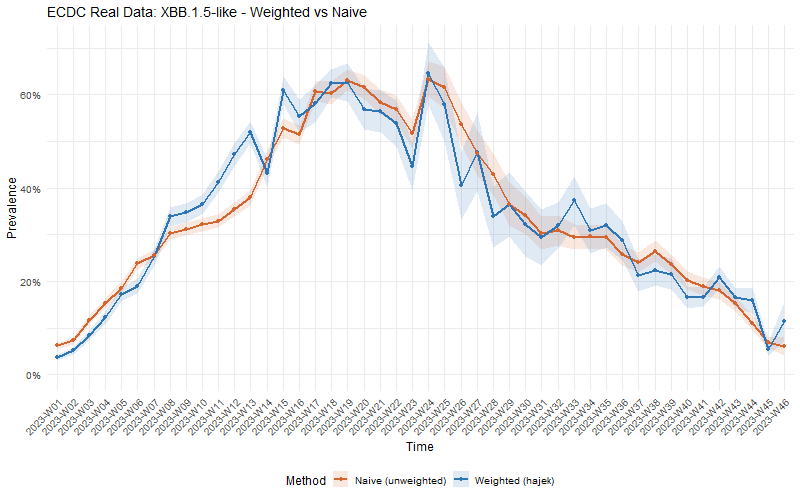
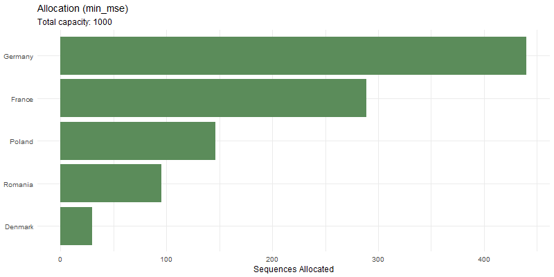
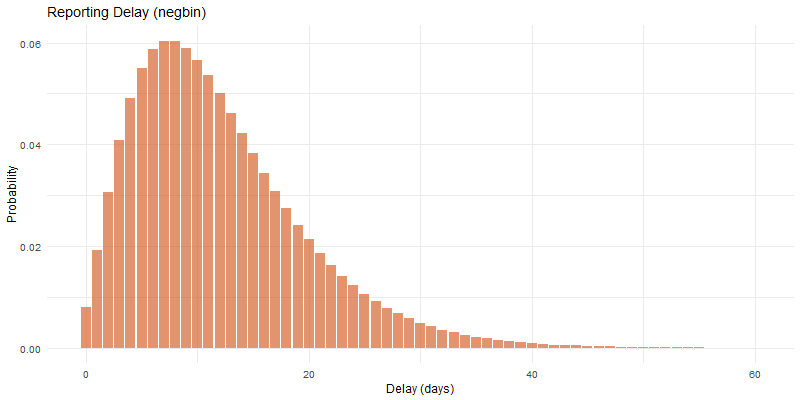
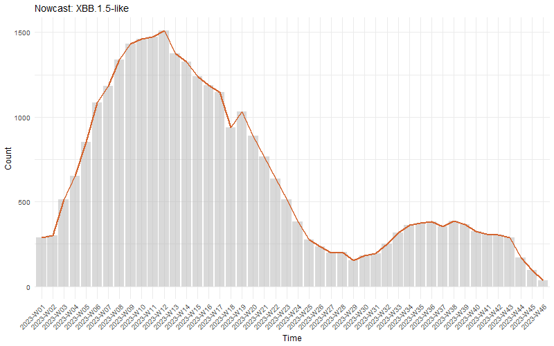
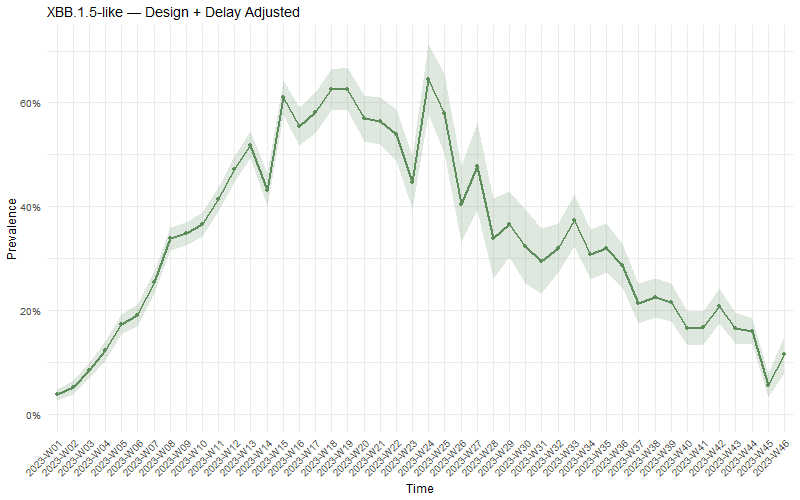

```{r setup, include = FALSE}
knitr::opts_chunk$set(collapse = TRUE, comment = "#>",
                      fig.width = 7, fig.height = 4.5, dev = "png")
has_figs <- file.exists("figures/ecdc_rates.png")
```

## Motivation

The examples in other vignettes use simulated data. Here we demonstrate
survinger on **real surveillance data** from the European Centre for Disease
Prevention and Control (ECDC), showing that design weighting produces
meaningfully different estimates than naive methods.

## Data source

We use the ECDC's open COVID-19 variant surveillance dataset, which reports
weekly variant detections by EU/EEA country. The data is publicly available
at <https://opendata.ecdc.europa.eu/covid19/virusvariant/>.

Five countries with dramatically different sequencing capacities:

| Country   | Approx. sequencing rate | Category  |
|-----------|------------------------|-----------|
| Denmark   | ~12%                   | Very high |
| Germany   | ~4%                    | High      |
| France    | ~2.5%                  | Medium    |
| Poland    | ~0.8%                  | Low       |
| Romania   | ~0.3%                  | Very low  |

This 40-fold range means naive prevalence estimates are dominated by
Denmark, even though it represents a small fraction of European population.

## Setting up the design

```{r design, eval = FALSE}
library(survinger)

# ecdc_surveillance is pre-processed from ECDC open data
# See data-raw/process_ecdc.R for the reproducible processing script
design <- surv_design(
  data = ecdc_surveillance$sequences,
  strata = ~ region,
  sequencing_rate = ecdc_surveillance$population[c("region", "seq_rate")],
  population = ecdc_surveillance$population
)
```

## Sequencing inequality

```{r rates-plot, echo = FALSE, eval = has_figs, out.width = "100%"}

```

Denmark sequences over 40 times more per capita than Romania ---
a **Gini coefficient of 0.54** indicating high inequality.

## The bias problem: weighted vs naive

```{r compare-plot, echo = FALSE, eval = has_figs, out.width = "100%"}

```

**Key finding:** On this real European data, the naive estimate
deviates from the design-weighted estimate by an average of
**3.8 percentage points** --- enough to change public health
decision-making about variant risk levels.

## Optimal resource allocation

```{r alloc-plot, echo = FALSE, eval = has_figs, out.width = "100%"}

```

## Delay correction and nowcasting

```{r delay-plot, echo = FALSE, eval = has_figs, out.width = "100%"}

```

```{r nowcast-plot, echo = FALSE, eval = has_figs, out.width = "100%"}

```

## Combined correction

```{r adjusted-plot, echo = FALSE, eval = has_figs, out.width = "100%"}

```

## Key takeaways

1. **Sequencing inequality is real and large** (40-fold range, Gini = 0.54).
2. **Naive estimates are biased** (3.8 pp average difference).
3. **Design weighting corrects this** using inverse-probability weights.
4. **Delay correction matters** for the most recent 2--3 weeks.
5. **survinger handles all of this** in a unified pipeline.

## Reproducibility

The full processing script is in `data-raw/process_ecdc.R` in the
package source. Raw data from ECDC can be re-downloaded at any time.
